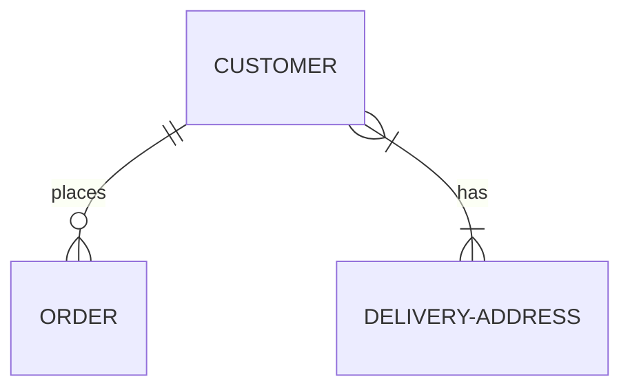

# Data Schema Modelling Workshop

_RAiD Engineering Meetup Aug 2025_

---
## Objectives

1. From real-world stories to database schema
2. Clean, efficient, and easy to change design
3. Confidence with database design tools
4. Improve database speed
5. Change database schema without breaking things

---
## Agenda

1. [Introduction to Schema and Tools](#introduction-to-schema-and-tools)
3. [Designing Conceptual Schema](materials/3_Conceptual_Schema.md)
4. [Designing Logical Schema](materials/4_Logical_Schema.md)
5. [Implementing Physical Schema with Prisma](materials/5_Physical_Schema.md)
6. [Database Indexing](materials/6_Indexing.md)
7. [Schema Change and Migrations](materials/7_Migrations.md)

---
## Instructions

1. Clone or fork this repository
3. [Workshop Scenario](materials/0_Workshop_Scenario.md)
4. Attempt the exercises along the way
    - Check out the [sample solutions](materials/sample-solutions)
5. Ask questions - raise a hand or ask your neighbor
6. If this is too easy for you, help a neighbor

---
## Prerequisites

You will need a laptop with:
- Node
- Docker
- Visual Studio Code or other code editor

---
## Types of Schema

| Feature               | Conceptual | Logical | Physical |
|-----------------------|:----------:|:-------:|:--------:|
| Entity Names          |     ✅      |   ✅    |          |
| Entity Relationships  |     ✅      |   ✅    |          |
| Attributes            |            |   ✅    |          |
| Primary/Foreign Keys  |            |   ✅    |   ✅     |
| Table/Column Names    |            |         |   ✅     |
| Column Data Types     |            |         |   ✅     |

---
### Conceptual Schema

- High-level design of ***entities*** and ***relationships***
    - **Entity**: type of data 
    - **Relationship**: how entities are connected

---
### Logical Schema

- Medium level design, adding ***attributes*** and ***keys*** to entities
    - **Attribute**: data stored in an entity
    - **Primary Key**: unique identifier for an entity
    - **Foreign Key**: reference to another entity's primary key

---
### Physical Schema

