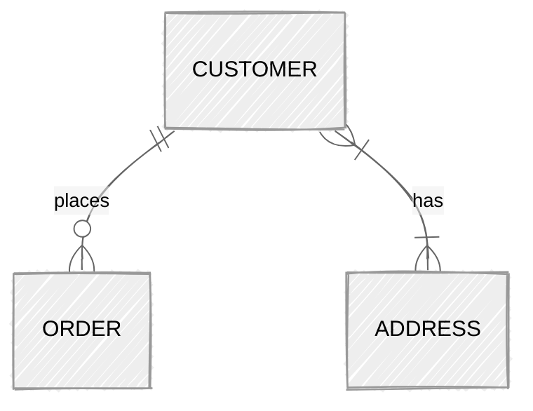
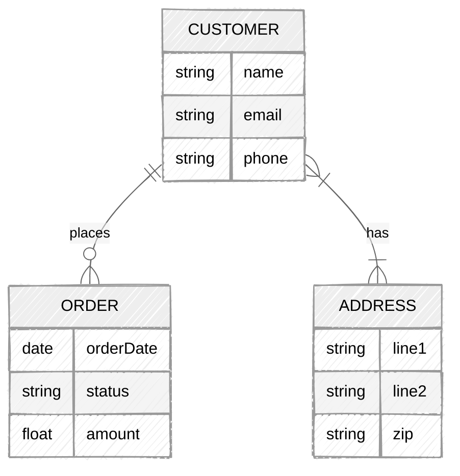

# Data Schema Modelling Workshop

_RAiD Engineering Meetup Aug 2025_

---

## Objectives

1. From real-world stories to database schema

2. Clean, efficient, and easy to change design

3. Confidence with database design tools

4. Improve database speed

5. Change database schema without breaking things

---

## Agenda

1. [Introduction to Schema and Tools](#introduction-to-schema-and-tools)

2. [Designing Conceptual Schema](#conceptual-schema)

3. [Designing Logical Schema](#logical-schema)

4. [Implementing Physical Schema with Prisma](#physical-schema)

5. [Database Indexing](#indexing)

6. [Schema Change and Migrations](#migrations)

---

## Instructions

1. Clone or fork this repository

2. [Workshop Scenario](exercises/Workshop-Scenario.md)

3. Attempt the exercises along the way

   - Check out the [sample solutions](exercises/sample-solutions)

4. Ask questions - raise a hand or ask your neighbor

5. If this is too easy for you, help a neighbor

---

## Prerequisites

- A laptop with:

  - Node
  - Docker
  - Visual Studio Code or other code editor

- Basic knowledge of:
  - Typescript
  - Express.js

---

## Types of Schema

| Feature              | Conceptual | Logical | Physical |
| -------------------- | :--------: | :-----: | :------: |
| Entity Names         |     ✅     |   ✅    |          |
| Entity Relationships |     ✅     |   ✅    |          |
| Attributes           |            |   ✅    |          |
| Primary/Foreign Keys |            |   ✅    |    ✅    |
| Table/Column Names   |            |         |    ✅    |
| Column Data Types    |            |         |    ✅    |

---

### Conceptual Schema

- High-level design of **_entities_** and **_relationships_**

  - **Entity**: type of data
  - [**Relationship**](https://miro.medium.com/v2/resize:fit:4800/format:webp/0*HbaPwlVdszf8etER.png): how entities are connected

- Map out the entities represented in the system



---

### Logical Schema

- Medium level design, adding **_attributes_** and **_keys_** to entities

  - **Attribute**: data stored in an entity
  - **Primary Key**: unique identifier for an entity
  - **Foreign Key**: reference to another entity's primary key

- Define where and how data is stored



---

### Physical Schema

- Full implementation details

- Dependent on the database system

- Includes:
  - Table & Column names
  - Data types (specific to the db, e.g. `VARCHAR(255)`)
  - Indexes
  - Constraints (optional)

---

### Tools for Schema Design

- Powerpoint, slides, miro, whiteboard

- [Draw.io](https://draw.io)

- [Mermaid.js](https://mermaid.js.org/)
  - Natively supported by github & gitlab
  - [VS Code extension](https://marketplace.visualstudio.com/items?itemName=bierner.markdown-mermaid)
  - [Online editor](https://mermaid.live/)

---

### Exercise 1: Designing Conceptual Schema

- Design a conceptual schema for the [workshop scenario](exercises/Workshop-Scenario.md)

- Use any tool as you prefer

- Skip relationship types for now

- [Sample solution](exercises/sample-solutions/1_2_schema_diagrams/1_Conceptual_Schema.md)

---

### Exercise 2: Designing Logical Schema

- Design a logical schema for the [workshop scenario](exercises/Workshop-Scenario.md)

- Think of other unexplicit requirements

  - Edge cases
  - Non-functional

- [Sample solution](exercises/sample-solutions/1_2_schema_diagrams/2_Logical_Schema.md)

---

### Database Normalization

- Eliminate duplicates

- Normalization Forms:

  1. [First Normal Form](#first-normal-form-1nf): "No repeating groups"

     - One value per column, per row
     - Minimum required to run a pivot table

  2. [Second Normal Form](#second-normal-form-2nf): "No partial dependencies"

     - No repeated column values across rows\*

  3. [Third Normal Form](#third-normal-form-3nf): "No transitive dependencies"
     - No column that depends on another column
     - No column that can be derived from another column

- Evaluated **_per relationship_**

-v-

#### First Normal Form (1NF)

Conceptual & Logical Schema:


<small>
Orders:

| name  | contact... | zip ... | status  | amount | orderDate  |
| ----- | ---------- | ------- | ------- | ------ | ---------- |
| Alice | 123456789  | 10001   | paid    | 100    | 2024-01-01 |
| Alice | 123456789  | 10001   | shipped | 200    | 2024-01-05 |
| Bob   | 987654321  | 20002   | pending | 300    | 2024-02-01 |

</small>

-v-

#### Second Normal Form (2NF)

Conceptual & Logical Schema:


-v-

#### Second Normal Form (2NF)

<small>
Customers:

| id  | name        | phone     | line1       | line2  | zip   |
| --- | ----------- | --------- | ----------- | ------ | ----- |
| 1   | Alice Smith | 123456789 | 12 Main St  | Apt 3B | 10001 |
| 2   | Bob Jones   | 987654321 | 99 River Rd | -      | 20002 |

Orders:
|id | status | amount | Date|
|----------|----------|--------|------------|
| 1 | paid | 100 | 2024-01-01|
| 1 | shipped | 200 | 2024-01-05|
| 2 | pending | 300 | 2024-02-01|
</small>

-v-

#### Third Normal Form (3NF)

<small>
Customers:

| id  | name        | email             | phone      | addressId |
| --- | ----------- | ----------------- | ---------- | --------- |
| 1   | Alice Smith | alice@example.com | 1234567890 | 101       |
| 2   | Bob Jones   | bob@example.com   | 9876543210 | NULL      |
| 3   | Carol White | carol@example.com | 4561237890 | 102       |

Addresses:

| id  | line1       | line2   | zip   |
| --- | ----------- | ------- | ----- |
| 101 | 12 Main St  | Apt 3B  | 10001 |
| 102 | 500 Oak Ave | Unit 7A | 30303 |

Orders:

| id  | customerID | orderDate  | status    | amount |
| --- | ---------- | ---------- | --------- | ------ |
| 201 | 1          | 2024-01-01 | paid      | 100.00 |
| 202 | 1          | 2024-01-05 | shipped   | 200.00 |
| 203 | 2          | 2024-02-01 | pending   | 300.00 |
| 204 | 3          | 2024-03-12 | delivered | 150.00 |

</small>

_See previous examples for conceptual & logical schema_

---

### [Prisma ORM](https://www.prisma.io/)

- Mordern, Typesafe ORM in RAiD's stack

- Provides an API to [define your model in code](https://www.prisma.io/docs/orm/prisma-schema/data-model/models)

```prisma
model Customer {
    id               Int     @id @default(autoincrement())
    name             String
    email            String  @unique
    phone            String
    orders[]         Order
    address?         Address
}

model Order {
    id               Int     @id @default(autoincrement())
    orderDate        Date
    status           String
    totalAmount      Float
    user             User    @relation(fields: [userId], references: [id])
    userId           Int
}

model Address {
    id               Int     @id @default(autoincrement())
    user             User    @relation(fields: [userId], references: [id])
    userId           Int     @unique
}
```

---

### Exercise 3: Implement Physical Schema with Prisma

- Design and implement physical schema for the [workshop scenario](exercises/Workshop-Scenario.md)

- Use Prisma to [define your models](./exercises/3_physical_schema/schema.prisma)

- `$ npm run start-3` to observe the schema generation

- See [prisma docs](https://www.prisma.io/docs/orm/prisma-client/setup-and-configuration/introduction) for instructions to generate and use the client

- `$ npm run sample-3` to observe the [sample solution](./exercises/sample-solutions/3_physical_schema/schema.prisma)

---

### Common Patterns for RSAF

- Soft deletion

  - Audit purposes
  - Support rollback/undo

- Audit logs/data versions
  - Track who/when performed actions
  - Track changes to data over time
  - Support rollback/undo

---

### [Indexing](https://www.postgresql.org/docs/current/indexes-types.html)

- Speeds up data retrieval

- But, adds overhead to modicifications

- Create indexes via:

  - SQL Commands
  - [Prisma](https://www.prisma.io/docs/orm/prisma-schema/data-model/indexes)

- Types of Indexes:
  - **B-tree**: equality & range (default for PG)
  - ~~**Hash**: Fast for equality checks, but not range queries~~
  - **GIN**: Full text search
  - **GiST**: nearest neighbor - good for spatial data

---

### Exercise 4: Compare Indexing Performance

- Have a look at the [exercise schema](exercises/4_indexing/schema.prisma)

- `$ npm run start-4` to seed the data and benchmark the performance. Observe:

  - Time taken to seed data
  - Time taken to retrieve queries by user
  - Query plans for retrieving queries by user

- Amend the schema to improve query performance

  - `$ npm run start-4` to observe the changes

- `$ npm run sample-4` to observe the [sample solution](exercises/sample-solutions/4_indexing/schema.prisma)

---

### Migrations

- Track changes to the schema over time

- Ensure data integrity during schema changes

- Learn the basics of [migration with Prisma](https://www.prisma.io/docs/guides/data-migration)

- Applicable to other tools like Liquibase, Flyway, or raw SQL migrations

---

### Prisma Migrate Tool

- [Introspect an existing schema into schema.prisma](https://www.prisma.io/docs/orm/reference/prisma-cli-reference#db-pull)

- [Generate migration files (SQL) based on schema.prisma changes](https://www.prisma.io/docs/orm/reference/prisma-cli-reference#migrate-diff)

- [Apply migrations to the database](https://www.prisma.io/docs/orm/reference/prisma-cli-reference#migrate-deploy)

- [Track which migrations are applied to the database](https://www.prisma.io/docs/orm/reference/prisma-cli-reference#migrate-resolve)

---

### Expand and Contract Pattern

- _Expand_: Add new features or capabilities

- _Contract_: Remove deprecated or unused features

- Incremental Schema Changes without data loss

- [Further reading](https://www.prisma.io/docs/guides/data-migration)

---

### Exercise 5: Schema Migration

- Migration of schema to incorporate external identity provider (e.g. Lectern)

- Lectern provides:
  - Authentication workflow
  - User details in each request
  - API to fetch user details by Id

---

### Desired schema change:


---

### Exercise 5: Schema Migration - Instructions

- `$ npx prisma migrate resolve --applied 0_init` to baseline the db from the sample-4

- `$ npm run reset-5` to return to this [state](./exercises/5_migration/README.md)

- "Expand" the [schema](./exercises/5_migration/schema.prisma)

- Create and apply the migration

- `$ npm run start-5` to simulate the "migration period" where users must log-in with Lectern + user and password

- "Contract" the schema, create and apply the migration

- `$ npm run sample-5` to observe the [sample solution](./exercises/sample-solutions/5_migration/README.md)

- [Useful commands](./exercises/5_migration/README.md)

---

### Recap

- Conceptual, Logical, Physical Schema

- Database Normalization

- Schema implementation with Prisma

- Indexing for performance

- Migrations with Prisma

---

Thank You!

# Questions?
