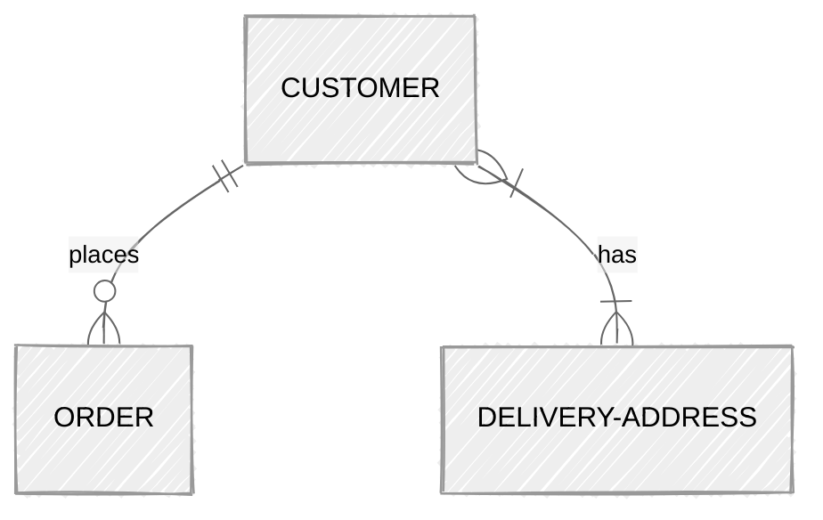

# Data Schema Modelling Workshop

_RAiD Engineering Meetup Aug 2025_

---
## Objectives

1. From real-world stories to database schema
2. Clean, efficient, and easy to change design
3. Confidence with database design tools
4. Improve database speed
5. Change database schema without breaking things

---
## Agenda

1. [Introduction to Schema and Tools](#introduction-to-schema-and-tools)
3. [Designing Conceptual Schema](materials/3_Conceptual_Schema.md)
4. [Designing Logical Schema](materials/4_Logical_Schema.md)
5. [Implementing Physical Schema with Prisma](materials/5_Physical_Schema.md)
6. [Database Indexing](materials/6_Indexing.md)
7. [Schema Change and Migrations](materials/7_Migrations.md)

---
## Instructions

1. Clone or fork this repository
3. [Workshop Scenario](materials/0_Workshop_Scenario.md)
4. Attempt the exercises along the way
    - Check out the [sample solutions](materials/sample-solutions)
5. Ask questions - raise a hand or ask your neighbor
6. If this is too easy for you, help a neighbor

---
## Prerequisites

You will need a laptop with:
- Node
- Docker
- Visual Studio Code or other code editor

---
## Types of Schema

| Feature               | Conceptual | Logical | Physical |
|-----------------------|:----------:|:-------:|:--------:|
| Entity Names          |     ✅      |   ✅    |          |
| Entity Relationships  |     ✅      |   ✅    |          |
| Attributes            |            |   ✅    |          |
| Primary/Foreign Keys  |            |   ✅    |   ✅     |
| Table/Column Names    |            |         |   ✅     |
| Column Data Types     |            |         |   ✅     |

---
### Conceptual Schema

- High-level design of ***entities*** and ***relationships***
    - **Entity**: type of data 
    - [**Relationship**](https://miro.medium.com/v2/resize:fit:4800/format:webp/0*HbaPwlVdszf8etER.png): how entities are connected
- Map out the entities represented in the system



---
### Logical Schema

- Medium level design, adding ***attributes*** and ***keys*** to entities
    - **Attribute**: data stored in an entity
    - **Primary Key**: unique identifier for an entity
    - **Foreign Key**: reference to another entity's primary key
- Define where and how data is stored


---
### Physical Schema

- Full implementation details
- Dependent on the database system
- Includes:
    - Table & Column names
    - Data types (specific to the db, e.g. `VARCHAR(255)`)
    - Indexes
    - Constraints (optional)

---
### Tools for Schema Design
- Powerpoint, slides, miro, whiteboard
- [Draw.io](https://draw.io)
- [**Mermaid.js**](https://mermaid.js.org/)
    - Natively supported by github & gitlab
    - [VS Code extension](https://marketplace.visualstudio.com/items?itemName=bierner.markdown-mermaid)
    - [Online editor](https://mermaid.live/)

---
### Exercise 1: Designing Conceptual Schema

- Design a conceptual schema for the [workshop scenario](materials/0_Workshop_Scenario.md)
- Use any tool as you prefer
- Skip relationship types for now
- [Sample solution](`1_Conceptual_Schema.md`)

---
### Exercise 2: Designing Logical Schema

- Design a logical schema for the [workshop scenario](materials/0_Workshop_Scenario.md)
- Think of other unexplicit requirements
    - Edge cases
    - Non-functional
- [Sample solution](`2_Logical_Schema.md`)

---
### Understanding Normalization Factors

- [1NF](#1nf): No repeating groups
- [2NF](#2nf): No partial dependencies
- [3NF](#3nf): No transitive dependencies
- Baseline: 3NF for all relationships

---
#### 1NF

[(back)](#understanding-normalization-factors)

---
#### 2NF
[(back)](#understanding-normalization-factors)

----
#### 3NF
[(back)](#understanding-normalization-factors)

---
### [Prisma ORM](https://www.prisma.io/)

- Mordern Database Toolkit in RAiD's stack
- Provides an API to [define your model in code](https://www.prisma.io/docs/orm/prisma-schema/data-model/models)

```prisma
model Customer {
    id               Int     @id @default(autoincrement())
    name             String
    email            String  @unique
    phone            String
    orders[]         Order
    deliveryAddress? DeliveryAddress
}

model Order {
    id               Int     @id @default(autoincrement())
    orderDate        Date
    status           String
    totalAmount      Float
    user             User    @relation(fields: [userId], references: [id])
    userId           Int
}

model DeliveryAddress {
    id               Int     @id @default(autoincrement())
    user             User    @relation(fields: [userId], references: [id])
    userId           Int     @unique
}
```

---
### Exercise 3: Implement Physical Schema with Prisma

- [Starter schema](starter)

