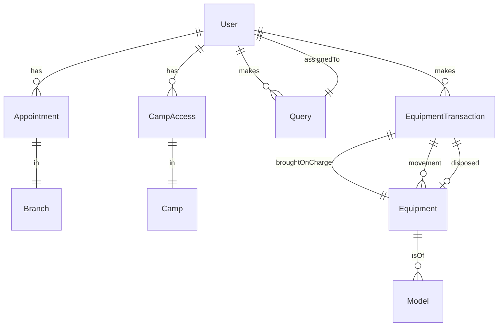

# Sample Solution for Exercise 1:

## Conceptual Schema for [Workshop Scenario](../Workshop-Scenario.md)

```mermaid
erDiagram
    User
    Appointment
    Branch

    User ||--o{ Appointment: has
    Appointment ||--|| Branch: in

    Camp
    CampAccess

    User ||--o{ CampAccess: has
    CampAccess ||--|| Camp: in

    Query

    User ||--o{ Query: makes
    Query ||--|| User: assignedTo

    Equipment
    EquipmentTransaction

    User ||--o{ EquipmentTransaction: makes
    EquipmentTransaction ||--|| Equipment: broughtOnCharge
    EquipmentTransaction ||--o{ Equipment: movement
    EquipmentTransaction ||--o| Equipment: disposed

    Model
    Equipment ||--o{ Model: isOf
```
