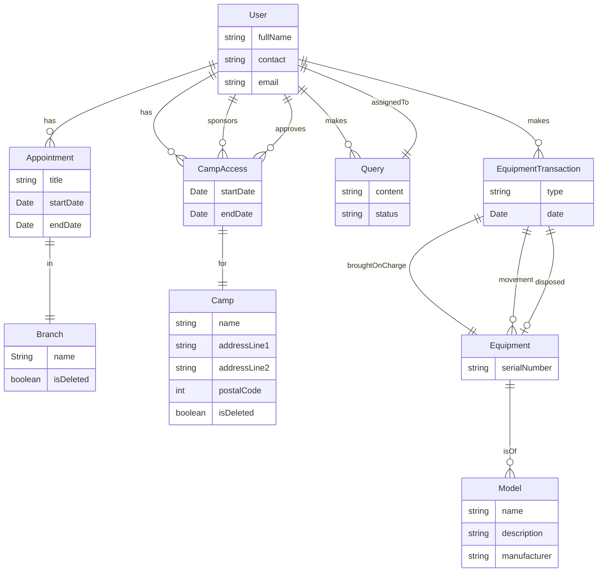

# Sample Logical Schema for [Workshop Scenario](../Workshop-Scenario.md)

```mermaid
erDiagram
    User {
        string fullName
        string contact
        string email
    }
    Appointment {
        string title
        Date startDate
        Date endDate
    }
    Branch {
        String name
        boolean isDeleted
    }

    User ||--o{ Appointment: has
    Appointment ||--|| Branch: in

    Camp {
        string name
        string addressLine1
        string addressLine2
        int postalCode
        boolean isDeleted
    }
    CampAccess {
        Date startDate
        Date endDate
    }

    User ||--o{ CampAccess: has
    User ||--o{ CampAccess: sponsors
    User ||--o{ CampAccess: approves
    CampAccess ||--|| Camp: for

    Query {
        string content
        string status
    }

    User ||--o{ Query: makes
    Query ||--|| User: assignedTo

    Equipment {
        string serialNumber
    }
    EquipmentTransaction {
        string type
        Date date
    }

    User ||--o{ EquipmentTransaction: makes
    EquipmentTransaction ||--|| Equipment: broughtOnCharge
    EquipmentTransaction ||--o{ Equipment: movement
    EquipmentTransaction ||--o| Equipment: disposed

    Model {
        string name
        string description
        string manufacturer
    }
    Equipment ||--o{ Model: isOf
```
